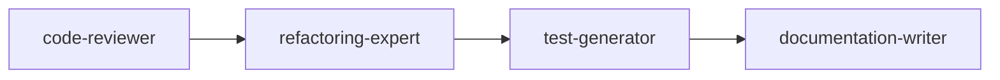
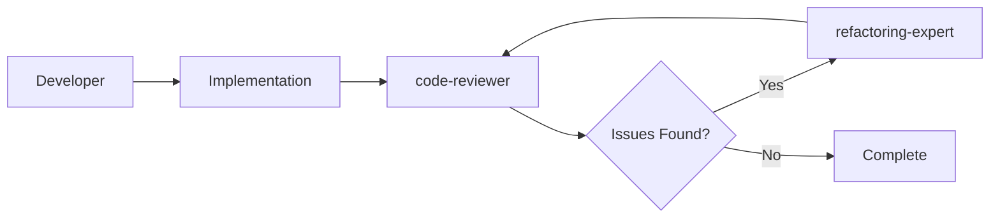

# 🚀 Awesome Claude Code Agents

An elite collection of specialized AI sub-agents that transform Claude Code into a powerhouse development environment. These agents work individually or collaboratively to handle everything from code review to design system extraction.

## 📋 Table of Contents
- [Overview](#overview)
- [Installation](#installation)
- [Available Agents](#available-agents)
- [Usage Guide](#usage-guide)
- [Agent Collaboration](#agent-collaboration)
- [Best Practices](#best-practices)
- [Examples](#examples)
- [Contributing](#contributing)

## 🎯 Overview

This repository contains a carefully crafted collection of Claude Code sub-agents, each specialized in specific development tasks. These agents can:

- 🔍 **Auto-activate** based on context
- 🤝 **Collaborate** on complex tasks
- 📈 **Improve code quality** dramatically
- ⚡ **Accelerate development** speed
- 🎨 **Extract design systems** from screenshots

## 📦 Installation

1. Clone this repository:
```bash
git clone https://github.com/yourusername/awesome-claude-code-agents.git
cd awesome-claude-code-agents
```

2. The agents are already in the correct location (`.claude/agents/`). They're ready to use immediately!

3. Verify installation:
```bash
ls .claude/agents/*.md
```

## 🤖 Available Agents

### Core Development Agents

#### 🔍 **code-reviewer**
Expert code review specialist that proactively reviews code for quality, security, and maintainability.
- **Auto-triggers**: After file saves, before commits, during refactoring
- **Specialties**: Security vulnerabilities, performance issues, code smells, SOLID principles
- **Example**: `"Review my recent changes"` or auto-activates on git diff

#### 🐛 **debugger**
Elite debugging specialist for errors, test failures, and unexpected behavior.
- **Auto-triggers**: On errors, test failures, exceptions
- **Specialties**: Root cause analysis, stack trace interpretation, systematic problem-solving
- **Example**: `"Debug this error: TypeError: Cannot read property..."` 

#### 🧪 **test-generator**
Comprehensive test creation specialist generating unit, integration, and E2E tests.
- **Auto-triggers**: After new functions/classes, low test coverage
- **Specialties**: Edge cases, mocking strategies, test patterns, high coverage
- **Example**: `"Generate tests for the UserService class"`

#### 📝 **documentation-writer**
Professional documentation specialist for READMEs, APIs, and code comments.
- **Auto-triggers**: After code changes, missing documentation
- **Specialties**: API docs, architecture diagrams, user guides, JSDoc/docstrings
- **Example**: `"Document the payment processing module"`

#### 🔧 **refactoring-expert**
Code improvement specialist mastering clean code principles and design patterns.
- **Auto-triggers**: Code smells detected, before major features
- **Specialties**: SOLID principles, performance optimization, technical debt reduction
- **Example**: `"Refactor this function to be more maintainable"`

### Language Specialists

#### 🐍 **python-expert**
Elite Python specialist mastering advanced features and Pythonic patterns.
- **Specialties**: Decorators, generators, async/await, type hints, context managers
- **Frameworks**: FastAPI, Django, Flask, asyncio
- **Example**: `"Implement an async rate limiter in Python"`

#### 📘 **typescript-expert**
TypeScript master pushing the type system to its limits.
- **Specialties**: Advanced types, generics, decorators, type-level programming
- **Frameworks**: React, Node.js, Angular, Vue
- **Example**: `"Create type-safe API client with full inference"`

### Unique Specialist

#### 🎨 **visual-design-extractor**
Extracts comprehensive design systems from screenshots.
- **Auto-triggers**: When implementing UI from designs
- **Specialties**: Color extraction, typography analysis, spacing systems, component patterns
- **Output**: Design tokens, Tailwind config, React components
- **Example**: `"Extract design system from @screenshot.png"`

## 📖 Usage Guide

### Automatic Invocation

Agents automatically activate based on context:

```python
# Writing a new function triggers documentation-writer
def process_payment(amount, card):
    # Agent will suggest comprehensive documentation
    pass

# Making changes triggers code-reviewer
# The agent will automatically review for quality and security

# Encountering an error triggers debugger
# Agent will analyze and provide solution
```

### Explicit Invocation

Mention the agent by name:

```
"Use the code-reviewer to check my PaymentService class"
"Have the test-generator create integration tests for the API"
"Get the python-expert to optimize this data processing pipeline"
```

### Combined Commands

```
"Review and refactor this module" 
# Activates: code-reviewer → refactoring-expert

"Debug and fix with tests"
# Activates: debugger → test-generator

"Document and review the architecture"
# Activates: documentation-writer → code-reviewer
```

## 🤝 Agent Collaboration

### Sequential Workflows



**Example**: "Improve code quality"
1. **code-reviewer** identifies issues
2. **refactoring-expert** implements improvements
3. **test-generator** ensures coverage
4. **documentation-writer** updates docs

### Parallel Execution

Multiple agents can work simultaneously:
- **Performance optimization**: python-expert + refactoring-expert
- **Full feature**: typescript-expert + test-generator + documentation-writer

### Validation Loops



## 💡 Best Practices

### 1. Let Agents Auto-Activate
- Trust the automatic triggers
- Agents know when they're needed
- Reduces cognitive load

### 2. Be Specific with Requests
```
❌ "Fix this"
✅ "Debug the authentication error in login.js line 45"

❌ "Make it better"
✅ "Refactor for better error handling and add logging"
```

### 3. Leverage Agent Expertise
- Use language experts for language-specific features
- Use code-reviewer before commits
- Use test-generator for critical paths

### 4. Combine Agents Strategically
- Review → Refactor → Test → Document
- Debug → Fix → Test → Review

### 5. Provide Context
- Include error messages
- Mention frameworks/libraries
- Specify requirements

## 🌟 Examples

### Example 1: Full Feature Development

```
User: "Implement user authentication with JWT"

Agents activated:
1. typescript-expert - Creates type-safe auth service
2. test-generator - Generates comprehensive test suite  
3. documentation-writer - Documents API endpoints
4. code-reviewer - Ensures security best practices
```

### Example 2: Bug Fix Workflow

```
User: "Getting 'undefined is not a function' in checkout process"

Agents activated:
1. debugger - Identifies root cause
2. typescript-expert - Implements type-safe fix
3. test-generator - Creates regression test
4. code-reviewer - Validates the fix
```

### Example 3: Design Implementation

```
User: "Implement this design @dashboard-mockup.png"

Agents activated:
1. visual-design-extractor - Extracts design system
2. typescript-expert - Creates React components
3. documentation-writer - Documents component API
```

### Example 4: Performance Optimization

```
User: "The data processing is too slow"

Agents activated:
1. python-expert - Analyzes bottlenecks
2. refactoring-expert - Implements optimizations
3. test-generator - Ensures functionality preserved
4. documentation-writer - Documents performance improvements
```

## 🛠️ Advanced Usage

### Custom Workflows

Create your own agent combinations:

```bash
# Quality sprint
"Run a comprehensive quality improvement on the codebase"
# Activates all quality-focused agents in sequence

# Security audit
"Perform security review with fixes"
# code-reviewer (security focus) → refactoring-expert → test-generator

# Documentation sprint
"Generate complete documentation for the API"
# documentation-writer → code-reviewer → visual diagrams
```

### Agent Specialization

Some agents excel in specific scenarios:

| Scenario | Best Agent(s) |
|----------|--------------|
| Memory leaks | debugger + python-expert |
| Type errors | typescript-expert |
| API design | documentation-writer + code-reviewer |
| UI from mockup | visual-design-extractor |
| Test coverage | test-generator |
| Code smells | refactoring-expert |

## 🤔 Troubleshooting

### Agent Not Activating?
- Check if the agent file exists in `.claude/agents/`
- Be more specific in your request
- Manually invoke with "Use [agent-name] to..."

### Wrong Agent Activated?
- Provide more context
- Explicitly mention the desired agent
- Use specific keywords related to the agent's expertise

### Agents Conflicting?
- Normal! Different specialists may have different approaches
- Ask for clarification: "Reconcile the suggestions from code-reviewer and refactoring-expert"

## 🚀 Future Agents

Coming soon:
- **go-expert** - Go language specialist
- **react-expert** - React framework specialist  
- **security-auditor** - Security vulnerability specialist
- **performance-optimizer** - Performance bottleneck eliminator
- **ai-engineer** - LLM integration specialist

## 🤝 Contributing

Want to add your own agents? Follow these guidelines:

1. Create agent file: `.claude/agents/your-agent.md`
2. Use the required format:
```markdown
---
name: agent-name
description: Clear description of when to use this agent
tools: Read, Write, Edit, etc.
---

Agent system prompt...
```

3. Make agents:
   - Focused on one expertise area
   - Proactive with clear triggers
   - Provide actionable output
   - Include examples

## 📜 License

MIT License - see LICENSE file

